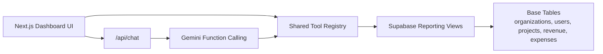

# RI AI CFO Dashboard

RI AI CFO Dashboard is a scope-aware financial intelligence app for Robotic Imaging. It shows deterministic KPI cards, margin and travel trends, expense breakdowns, and anomaly findings at global, organization, and project scope. A Gemini-powered CFO sidebar sits alongside the dashboard, but it never does math itself: it calls a small, typed tool layer that reads from Supabase reporting views and then explains the returned numbers in plain language.

## Architecture



## Key Decisions

### Tool calling instead of NL2SQL

The LLM does not see schema details and never writes free SQL. It gets exactly five business tools:

- `get_scope_financials`
- `get_expense_breakdown`
- `get_travel_trend`
- `detect_anomalies`
- `forecast_expenses`

That keeps the AI layer auditable, reduces hallucination surface area, and matches the assessment’s explicit preference for function/tool calling over prompt stuffing.

### SQL views for derived financial logic

All reusable financial truth lives in additive reporting views:

- `expense_anomalies_v`
- `project_financials_v`
- `org_financials_v`
- `monthly_travel_trends_v`

The base schema remains untouched. This keeps derived business logic centralized, deterministic, and easy to inspect in code review.

### The AI never does math

Revenue, expenses, profit, margin, travel trends, forecasts, and anomaly counts are computed in SQL or TypeScript only. Gemini’s role is limited to:

- deciding which tool(s) to call
- passing the correct scope
- synthesizing the returned results into a CFO-style answer

This is the core architectural boundary of the project.

### Deterministic anomalies first, interpretation second

Anomaly flags come from four hard-coded rules:

- unauthorized category
- duplicate expense
- large equipment
- category outlier

The UI and the chat both read the same anomaly source of truth. The AI can explain flagged rows, but it cannot invent new anomaly counts.

### One reusable dashboard across three scopes

The app uses the same dashboard composition for:

- `/`
- `/org/[orgId]`
- `/project/[projectId]`

That keeps the product coherent and makes scope inheritance in chat straightforward.

### Shared handlers for UI and AI

The dashboard itself calls the same server-side tool handlers that Gemini uses. KPI values are not reimplemented in page components, so the UI and the AI stay aligned.

## Stack

- Next.js App Router
- TypeScript strict mode
- Tailwind CSS
- Supabase
- Gemini via `@google/genai`
- Recharts
- Radix primitives for drawer/scroll behavior

## Local Setup

1. Install dependencies:

```bash
npm install
```

2. Create `.env.local`:

```bash
NEXT_PUBLIC_SUPABASE_URL=https://tzrsypzpeurtqbepvptl.supabase.co
SUPABASE_SERVICE_ROLE_KEY=your-service-role-key
GEMINI_API_KEY=your-gemini-api-key
```

The app is env-driven and can point at any Supabase project that has the assessment schema, seed data, and reporting migrations applied. The default development target used here is the already-seeded `tzrsypzpeurtqbepvptl` project.

3. Start the app:

```bash
npm run dev
```

4. Optional verification commands:

```bash
npm run typecheck
npm run build
npm run verify:tools
```

## Database Setup

The base schema migration already exists in:

- `supabase/migrations/20260409122600_init_ri_demo.sql`

The reporting layer is added in:

- `supabase/migrations/20260409143000_add_reporting_views.sql`

To push the reporting migration to the linked remote project:

```bash
supabase link --project-ref tzrsypzpeurtqbepvptl
supabase db push --include-all
```

## Deployment

Deploy the root project to Vercel. No subdirectory configuration is needed.

1. Add these env vars in Vercel:

- `NEXT_PUBLIC_SUPABASE_URL`
- `SUPABASE_SERVICE_ROLE_KEY`
- `GEMINI_API_KEY`

2. Deploy the repo root.

3. Verify:

- `/` loads with KPI cards, org table, and chat
- `/org/[orgId]` loads project drill-down
- `/project/[projectId]` loads expense detail
- the chat answers the three assessment prompts with tool-call badges visible

## Required Demo Prompts

Use these in the sidebar when recording the assessment walkthrough:

1. `What is our overall net profit margin across all Home Depot locations?`
2. `How have average travel costs per survey changed over the last 24 months, and what's the projected expense run-rate for the upcoming quarter?`
3. `Run an audit on technician expenses over the last year. Are there any duplicate flight billings or unusually large equipment purchases we should investigate?`

## What Was Intentionally Cut

The assessment explicitly rewards architectural clarity over feature count, so the app intentionally excludes:

- authentication
- CRUD flows
- pagination or virtualization
- streaming chat
- NL2SQL
- real-time updates
- heavyweight forecasting models
- pixel-polish work that doesn’t change product function

## Verification Summary

Local verification completed against the live Supabase backend:

- reporting migration pushed successfully
- tool smoke test passed across global, org, and project scopes
- `npm run typecheck` passed
- `npm run build` passed
- the three assessment chat prompts returned grounded answers through `/api/chat`

## Submission Placeholders

- GitHub repo URL: `TODO`
- Live Vercel URL: `TODO`
- Demo video URL: `TODO`
